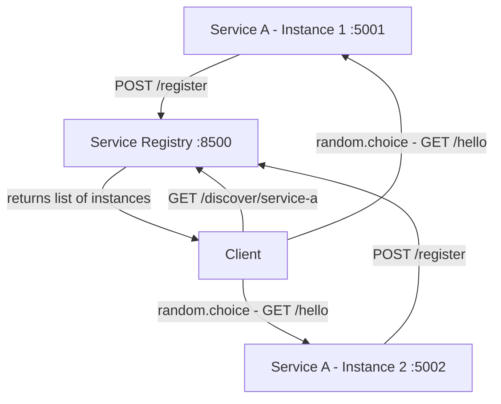

# Week 7 — Service Discovery with a Custom Python Registry

## Project Overview

This project demonstrates **service discovery** in a microservice architecture using a custom-built **Service Registry** written in Python (Flask). Two instances of the same service register themselves with the registry on startup, and a client continuously queries the registry to discover available instances and calls one at random. Everything runs in Docker containers orchestrated by Docker Compose.

---

## Architecture



### Component Descriptions

| Component | Description |
|---|---|
| **Service Registry** (`registry/`) | A Flask app on port 8500 that maintains an in-memory registry of service instances. Exposes `/register`, `/discover/<name>`, and `/services` endpoints. |
| **Service A** (`service/`) | A Flask microservice that registers itself with the registry on startup (with retry logic) and exposes `/hello` and `/health` endpoints. |
| **Client** (`client/`) | A Python script that polls the registry every 3 seconds, discovers instances of `service-a`, randomly picks one, and calls its `/hello` endpoint. |

---

## How to Run

### 1. Start all services

```bash
docker compose up --build
```

### 2. Watch the client logs

```bash
docker compose logs -f client
```

You should see the client alternating between Instance 1 (port 5001) and Instance 2 (port 5002).

### 3. Inspect the registry (optional)

```bash
# View all registered services
curl http://localhost:8500/services

# Discover instances of service-a
curl http://localhost:8500/discover/service-a
```

### 4. Shut down

```bash
docker compose down
```

---

## Assignment Requirements

| Requirement | How It's Satisfied |
|---|---|
| Run 2 instances of the same service | `service-a-1` and `service-a-2` are both built from `./service` with different ports (5001, 5002) |
| Both instances register with a service registry | Each instance POSTs to `http://registry:8500/register` on startup with retry logic |
| A client queries the registry to discover instances | The client calls `GET /discover/service-a` every 3 seconds |
| The client calls a randomly chosen instance | Uses `random.choice()` to select an instance and calls its `/hello` endpoint |
| GitHub repo | This repository |
| Architecture diagram | Mermaid diagram above |
| Working demo | Run `docker compose up --build` and watch `docker compose logs -f client` |

---

## Fault Tolerance Demo

Demonstrate that the client gracefully handles a service instance going down:

### 1. Start everything

```bash
docker compose up --build
```

### 2. Watch client logs (in a separate terminal)

```bash
docker compose logs -f client
```

You will see requests alternating between `service-a-1` and `service-a-2`.

### 3. Kill one instance

```bash
docker compose stop service-a-2
```

### 4. Observe behavior

- The client still discovers **both** instances from the registry (because the registry has no health-check eviction).
- When the client tries to call the stopped instance, it will get a connection error.
- When it picks the live instance, it succeeds normally.
- This demonstrates partial fault tolerance — the client continues operating with the remaining instance.

### 5. Bring it back

```bash
docker compose start service-a-2
```

---

## File Structure

```
week7-service-discovery/
├── registry/
│   ├── app.py              # Service registry Flask app
│   ├── requirements.txt    # Python dependencies (flask)
│   └── Dockerfile          # Docker build instructions
├── service/
│   ├── app.py              # Service instance Flask app
│   ├── requirements.txt    # Python dependencies (flask, requests)
│   └── Dockerfile          # Docker build instructions
├── client/
│   ├── client.py           # Discovery client script
│   ├── requirements.txt    # Python dependencies (requests)
│   └── Dockerfile          # Docker build instructions
├── docker-compose.yml      # Orchestration config for all containers
└── README.md               # This file
```


